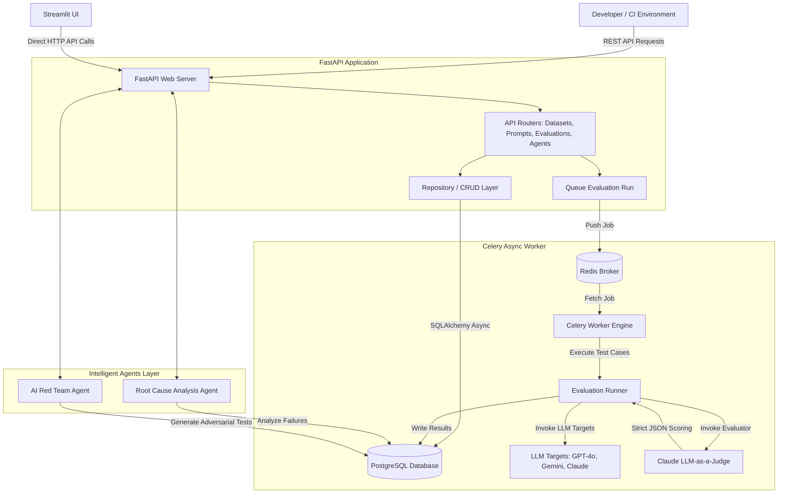

# Phase 1: Architecture Design & Directory Layout

This document describes the architectural layout, core systems, components, data flow, and directory structure of **EvalForge**.

---

## 1. System Architecture Diagram



---

## 2. Architecture Explanation

### Like I am 5 years old 🧸
> Imagine you have built a toy robot, and you want to make sure it answers questions nicely. 
> 
> 1. **Streamlit (The Toy Box Cover):** This is the screen with buttons where you can see how good the robot is doing and type in new questions.
> 2. **FastAPI (The Toy Shop Manager):** The clerk who listens to what you want (like "run tests on the robot") and writes down instructions on a ticket.
> 3. **PostgreSQL (The Giant Scrapbook):** A big, thick book where we write down every question we asked, what the robot said, and what score it got, so we never forget.
> 4. **Redis & Celery (The Helpers in the Backroom):** Because scoring the robot takes a long time, the manager doesn't do it himself. He puts the ticket in a tray (Redis). A helper in the back room (Celery) takes the ticket, asks the robot the questions, checks if the answers are correct, and writes the scores in the scrapbook.
> 5. **LLM Judge (The Teacher):** A super-smart teacher (Claude) who reads the robot's answers and gives them grades from 1 to 5.

### Industry Relevance 🚀
In production enterprise environments, LLMs are non-deterministic. A system cannot be shipped without automated evaluation. EvalForge models the design of enterprise LLMops tools like Braintrust, LangSmith, and Promptly.
- **Asynchronous Execution:** Model evaluations take time due to LLM rate limits and network latency. Blocking the web server process to wait for an LLM response is a critical anti-pattern. We offload tasks to **Celery** with **Redis**, ensuring API responsiveness.
- **Structured LLM Outputs:** Parsing natural language from LLMs is unreliable. Using strict JSON schemas (via Pydantic and JSON mode) allows programmatic validation and insertion into analytical databases.

### Interview Relevance 🎤
- **Why Celery/Redis instead of standard asyncio?** Standard `asyncio.gather` works for a few concurrent network requests, but lacks execution durability, rate limiting, and queue persistence. If the FastAPI process restarts, running evaluations are lost. Celery provides persistent tasks, retry schedules, and distributed worker scaling.
- **Why the Repository Pattern?** By abstracting our database transactions (CRUD layer) from our FastAPI endpoints, we can unit-test business logic using mock repositories or an in-memory database without altering our router logic.

---

## 3. Directory Layout

Below is the planned structure for the repository:

```
/Users/jimmycodes/LLMBench/
├── backend/
│   ├── app/
│   │   ├── __init__.py
│   │   ├── main.py
│   │   ├── core/
│   │   │   ├── __init__.py
│   │   │   ├── config.py           # Configuration and Environment variables
│   │   │   ├── database.py         # SQLAlchemy engine and session setup
│   │   │   ├── security.py         # API Key checking mechanisms
│   │   │   └── celery_app.py       # Celery worker initialization
│   │   ├── models/
│   │   │   ├── __init__.py
│   │   │   ├── base.py             # Declarative base model
│   │   │   ├── dataset.py          # Dataset & TestCase tables
│   │   │   ├── prompt.py           # Prompt and PromptArena tables
│   │   │   ├── evaluation.py       # EvaluationRun & EvaluationResult tables
│   │   │   └── regression.py       # RegressionReport tables
│   │   ├── schemas/
│   │   │   ├── __init__.py
│   │   │   ├── dataset.py          # Pydantic schemas for Datasets
│   │   │   ├── prompt.py           # Pydantic schemas for Prompts
│   │   │   ├── evaluation.py       # Pydantic schemas for Evaluations
│   │   │   └── regression.py       # Pydantic schemas for Regressions
│   │   ├── crud/
│   │   │   ├── __init__.py
│   │   │   ├── base.py             # Generic base CRUD repo
│   │   │   ├── dataset.py          # CRUD transactions for Datasets
│   │   │   ├── prompt.py           # CRUD transactions for Prompts
│   │   │   ├── evaluation.py       # CRUD transactions for Evaluations
│   │   │   └── regression.py       # CRUD transactions for Regressions
│   │   ├── api/
│   │   │   ├── __init__.py
│   │   │   ├── v1/
│   │   │   │   ├── router.py       # Main API aggregator
│   │   │   │   ├── datasets.py     # Dataset API endpoints
│   │   │   │   ├── prompts.py      # Prompt API endpoints
│   │   │   │   ├── evaluations.py  # Evaluation execution endpoints
│   │   │   │   └── agents.py       # Agent analytics endpoints
│   │   └── workers/
│   │       ├── __init__.py
│   │       ├── tasks.py            # Celery background tasks
│   │       └── evaluator.py        # Logic to call LLMs and invoke the Judge
│   ├── alembic.ini
│   ├── Dockerfile
│   └── requirements.txt
├── frontend/
│   ├── app.py                      # Streamlit primary dashboard
│   ├── pages/
│   │   ├── 01_datasets.py          # Dataset management view
│   │   ├── 02_prompt_arena.py      # Playground and Prompts benchmark
│   │   ├── 03_evaluation_hub.py    # Test executions and run histories
│   │   ├── 04_rca_console.py       # Root Cause Analysis and suggestions
│   │   └── 05_cost_analytics.py    # Performance & cost optimization chart
│   ├── Dockerfile
│   └── requirements.txt
├── agents/
│   ├── __init__.py
│   ├── base.py                     # Base Agent interface
│   ├── rca_agent.py                # Failure analysis & recommendation logic
│   └── red_team_agent.py           # Adversarial test data generator
├── tests/
│   ├── __init__.py
│   ├── conftest.py                 # Pytest fixtures and mocks
│   ├── test_api/
│   │   └── test_datasets.py
│   ├── test_evaluation/
│   │   └── test_judge.py
│   └── test_agents/
│       └── test_rca.py
├── progress/
│   └── phase_01_architecture.md    # Current file
├── README.md
├── docker-compose.yml
└── .github/
    └── workflows/
        └── ai_quality_gate.yml     # CI/CD run configuration
```

---

## 4. Directory Structure Explanation

### Like I am 5 years old 🧸
> Think of our project folder like a school backpack:
> - **`backend/`** is the pencil case containing the calculators, writing pads, and rulers we need to do math.
> - **`frontend/`** is the drawings and stickers on the outside of the backpack that make it look cool and easy to open.
> - **`agents/`** is the helper elves sitting in the pocket who help us fix hard math homework when we make mistakes.
> - **`tests/`** is the checklist we use to make sure we didn't forget our lunchbox or pencil.

### Industry Relevance 🚀
This folder structure implements **Clean Architecture** and **Feature Partitioning**:
- The separation between `backend/` and `frontend/` allows them to be containerized, deployed, and scaled independently.
- Keeping core database models (`models/`), validation layers (`schemas/`), and database transaction queries (`crud/`) split prevents overlapping responsibilities, which makes debugging faster and keeps codebase complexity linear.

### Interview Relevance 🎤
- **Why are schemas and models split?** `models/` represents the physical database representation (SQLAlchemy). `schemas/` represents the logical API request/response format (Pydantic). Splitting them prevents exposing internal DB columns (like hashed values or system auto-increments) and allows different API versions to map to the same database tables.
- **Why is there an `agents/` root directory instead of putting agents in `backend/app/`?** Agents in EvalForge represent decoupled reasoning pipelines. They can be invoked by the backend API, but they are architecturally standalone tools that could eventually run in scheduled CLI tasks or as microservices.
